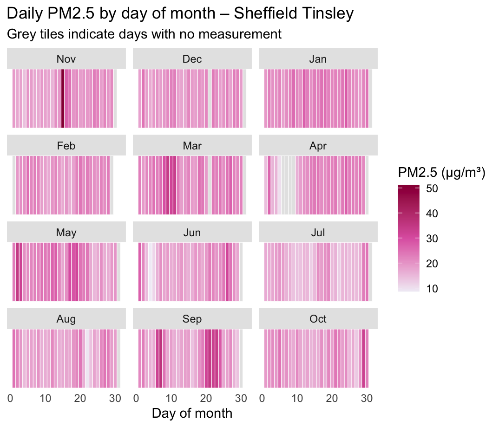
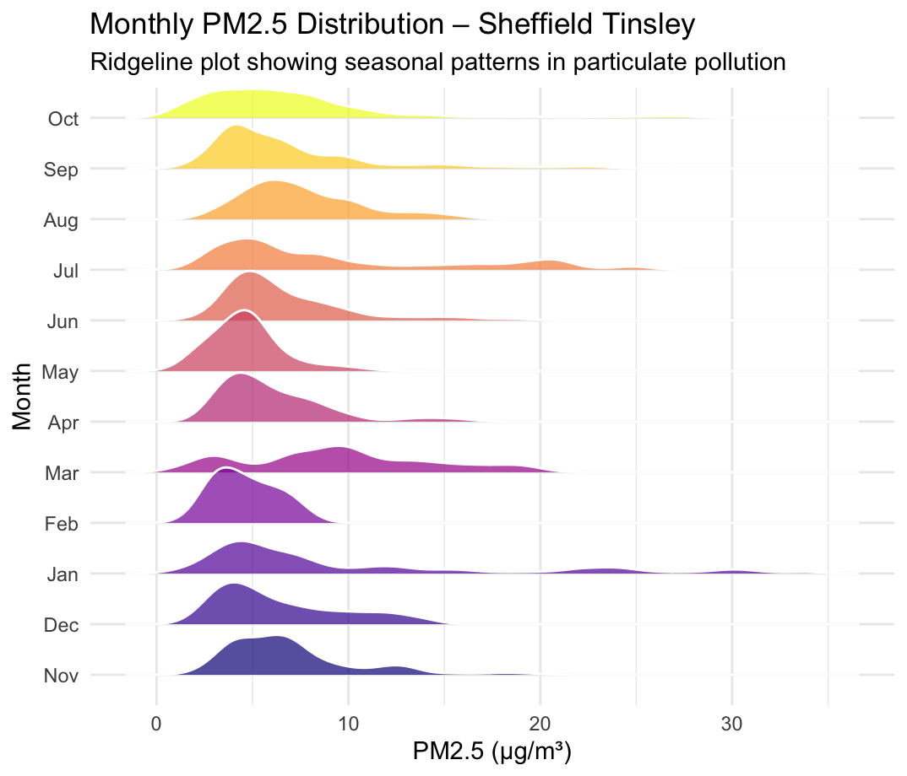
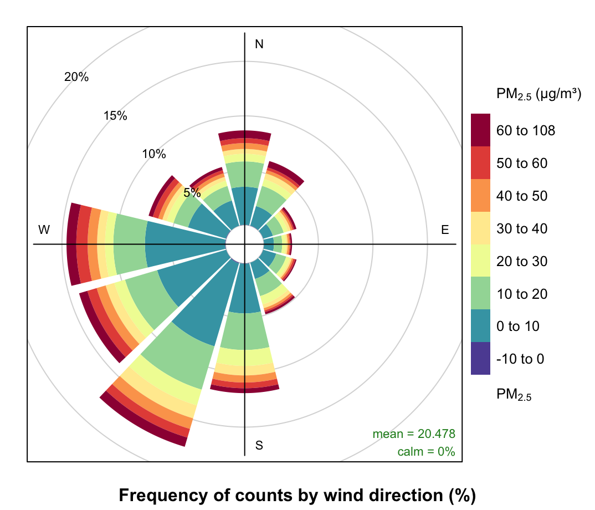
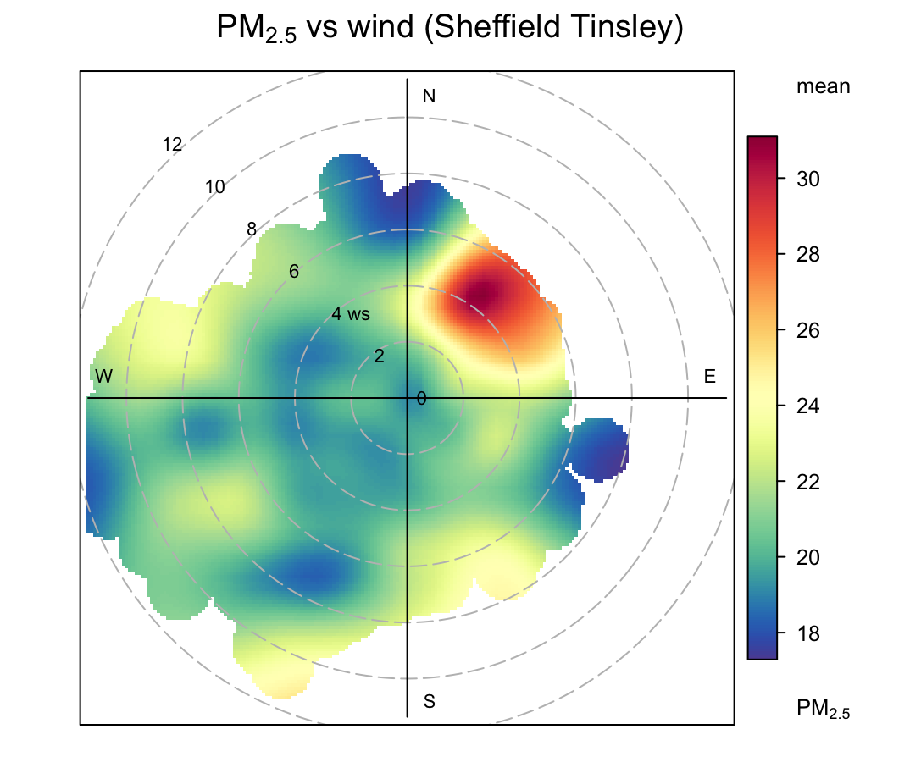

# IJC445-Data-Visualisation-Project

# IJC445 Composite Visualisation – PM2.5 & Meteorology (Sheffield Tinsley)

This project explores how PM2.5 levels vary across time and how they relate to local meteorological conditions at the Sheffield Tinsley monitoring site. Four visualisations were produced: a daily PM2.5 heatmap, a monthly ridgeline distribution, a pollution rose, and a polar plot combining PM2.5 with wind speed and direction. Together, these charts help highlight temporal patterns, seasonal behaviour, and possible upwind pollution sources.

## Visualisation Summary

### 1. Daily PM2.5 Heatmap
Shows day-by-day PM2.5 concentrations for each month (Nov–Oct). Darker colours indicate higher daily means, while grey tiles represent days without monitoring. This plot helps identify short pollution episodes and measurement gaps.

### 2. Monthly Ridgeline Plot
Displays the distribution of hourly PM2.5 values by month. Wider, right-skewed ridges indicate months with more frequent high-concentration hours, highlighting clear seasonal changes in pollution levels.

### 3. Pollution Rose
Illustrates how average PM2.5 varies by wind direction and wind-speed category. This helps identify which wind sectors are associated with higher pollution, giving clues about potential upwind sources.

### 4. Polar Plot (PM2.5 × Wind Speed × Wind Direction)
The polar plot provides a smoothed surface showing PM2.5 concentrations as a function of both wind direction (angle) and wind speed (radius). Colours represent mean PM2.5 levels.  

